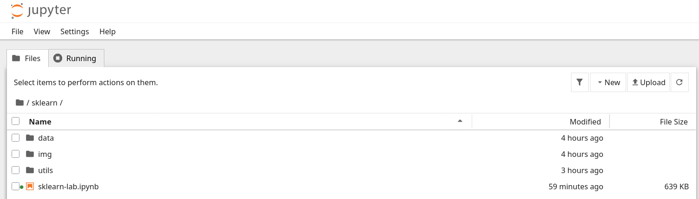
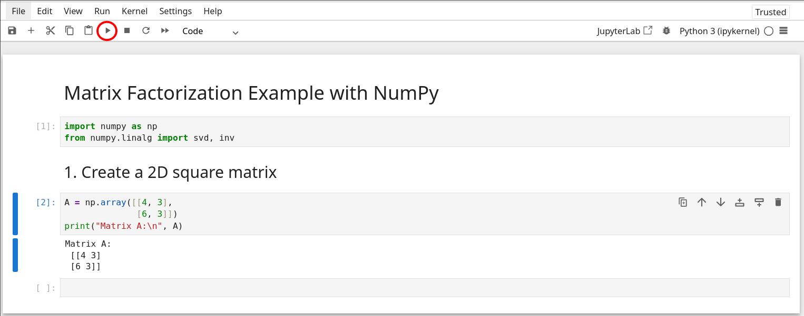

---
title:
- Machine Learning
subtitle:
- Laboratory on scikit-learn
aspectratio:
- 43
institute:
- University of Trento
author:
- \href{https://samuelebortolotti.github.io/}{Samuele Bortolotti}
- \href{https://steveazzolin.github.io/}{Steve Azzolin}
date:
- 11 November, 2025
lang: en
section-titles:
- false
theme:
- Copenhagen
colortheme:
- default
navigation:
- horizontal
logo:
- imgs/unitn.pdf
fontsize:
- 10mm

---

# Set-up on Google Colab

If you prefer to run the notebook in the cloud, use the `Google Colab` link provided in the repository or scan the QR code below.

{ height=1.5in }

No local installation is required; everything runs in your browser.

---

# Preliminaries (on your PC)

**1. Download the Material**

Download or clone the course repository from:

[https://github.com/samuelebortolotti/machine-learning-lab](https://github.com/samuelebortolotti/machine-learning-lab)

---

# Preliminaries (on your PC)

**2. Install Jupyter Notebook**

Open your terminal and install Jupyter using `pip`:

```bash
pip install jupyter-notebook
````

*Note:* If you are using Anaconda, Jupyter is already included.

---

# Preliminaries (on your PC)

**3. Navigate to the Project Folder**

Use the terminal to move into the `scikit` directory:

```bash
cd path/to/scikit
```

Then launch Jupyter Notebook:

```bash
jupyter-notebook
```

---

# Preliminaries (on your PC)

**4. Open Jupyter in Your Browser**

Once Jupyter starts, your browser will open automatically showing the current working directory.

Locate and open the notebook file:

**`scikit-learn.ipynb`**

*(Example view of the Jupyter file browser)*



---

# Running Cells in Jupyter

To execute a cell, you can either:

* Click the **Run** button in the toolbar, or
* Press **Shift + Enter** on your keyboard.



---

# Take-home Exercise

As a self-assessment exercise, complete a classification task using **Scikit-Learn**.

**Steps:**

1. Choose a dataset.
2. Train and tune a classifier (e.g., perform hyperparameter optimization).
3. Evaluate the model on the test set.
4. Compare performance across different classifiers.

---

# Suggested Datasets

You can find datasets in the [UCI Machine Learning Repository](https://archive.ics.uci.edu/):

* [Spambase](https://archive.ics.uci.edu/ml/datasets/spambase)
* [Optical Recognition of Handwritten Digits](https://archive.ics.uci.edu/ml/datasets/optical+recognition+of+handwritten+digits)
* [Abalone](https://archive.ics.uci.edu/ml/datasets/abalone)
* Additional datasets available at [https://archive.ics.uci.edu/](https://archive.ics.uci.edu/)

---

# Model Comparison

Compare the performance of multiple classifiers such as:

* Decision Tree
* Random Forest
* SVM

Perform hyperparameter tuning and report the evaluation metrics (e.g., accuracy, precision, recall, F1-score).
